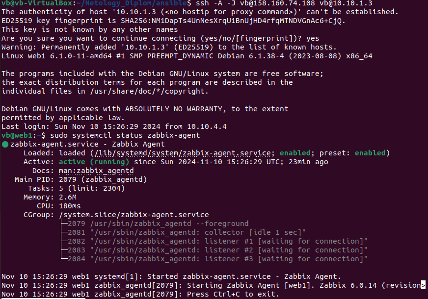
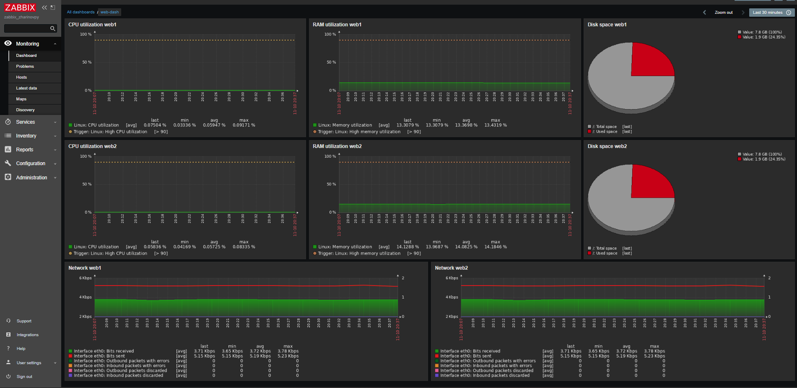

#  Дипломная работа по профессии «Системный администратор» - Жаринов Павел

Содержание
==========
* [Задача](#Задача)
* [Инфраструктура](#Инфраструктура)
    * [Сайт](#Сайт)
    * [Мониторинг](#Мониторинг)
    * [Логи](#Логи)
    * [Сеть](#Сеть)
    * [Резервное копирование](#Резервное-копирование)
* [Выполнение дипломной работы](#Выполнение-дипломной-работы)
    * [Infrastructure](#Infrastructure)
    * [Network](#Network)
    * [Security Groups](#Security-Groups)
    * [Load Balancer](#Load-Balancer)
    * [Backup](#Backup)
    * [Ansible](#Ansible)
    * [NGINX](#NGINX)
    * [Zabbix](#Zabbix)
    * [Elasticsearch](#Elasticsearch)
    * [Kibana](#Kibana)
    * [Filebeat](#Filebeat)

**ссылки на ресурсы** 
[Сайт](http://51.250.42.235/)
[Kibana](http://51.250.28.37:5601/) 
[Zabbix](http://84.201.161.108/zabbix)
zabbix - логин и пароль стандартные

---------

## Задача
Ключевая задача — разработать отказоустойчивую инфраструктуру для сайта, включающую мониторинг, сбор логов и резервное копирование основных данных. Инфраструктура должна размещаться в [Yandex Cloud](https://cloud.yandex.com/) и отвечать минимальным стандартам безопасности: запрещается выкладывать токен от облака в git. Используйте [инструкцию](https://cloud.yandex.ru/docs/tutorials/infrastructure-management/terraform-quickstart#get-credentials).

**Перед началом работы над дипломным заданием изучите [Инструкция по экономии облачных ресурсов](https://github.com/netology-code/devops-materials/blob/master/cloudwork.MD).**

## Инфраструктура
Для развёртки инфраструктуры используйте Terraform и Ansible.

Не используйте для ansible inventory ip-адреса! Вместо этого используйте fqdn имена виртуальных машин в зоне ".ru-central1.internal". Пример: example.ru-central1.internal  - для этого достаточно при создании ВМ указать name=example, hostname=examle !! 

Важно: используйте по-возможности **минимальные конфигурации ВМ**:2 ядра 20% Intel ice lake, 2-4Гб памяти, 10hdd, прерываемая. 

**Так как прерываемая ВМ проработает не больше 24ч, перед сдачей работы на проверку дипломному руководителю сделайте ваши ВМ постоянно работающими.**

Ознакомьтесь со всеми пунктами из этой секции, не беритесь сразу выполнять задание, не дочитав до конца. Пункты взаимосвязаны и могут влиять друг на друга.

### Сайт
Создайте две ВМ в разных зонах, установите на них сервер nginx, если его там нет. ОС и содержимое ВМ должно быть идентичным, это будут наши веб-сервера.

Используйте набор статичных файлов для сайта. Можно переиспользовать сайт из домашнего задания.

Виртуальные машины не должны обладать внешним Ip-адресом, те находится во внутренней сети. Доступ к ВМ по ssh через бастион-сервер. Доступ к web-порту ВМ через балансировщик yandex cloud.

Настройка балансировщика:

1. Создайте [Target Group](https://cloud.yandex.com/docs/application-load-balancer/concepts/target-group), включите в неё две созданных ВМ.

2. Создайте [Backend Group](https://cloud.yandex.com/docs/application-load-balancer/concepts/backend-group), настройте backends на target group, ранее созданную. Настройте healthcheck на корень (/) и порт 80, протокол HTTP.

3. Создайте [HTTP router](https://cloud.yandex.com/docs/application-load-balancer/concepts/http-router). Путь укажите — /, backend group — созданную ранее.

4. Создайте [Application load balancer](https://cloud.yandex.com/en/docs/application-load-balancer/) для распределения трафика на веб-сервера, созданные ранее. Укажите HTTP router, созданный ранее, задайте listener тип auto, порт 80.

Протестируйте сайт
`curl -v <публичный IP балансера>:80` 

### Мониторинг
Создайте ВМ, разверните на ней Zabbix. На каждую ВМ установите Zabbix Agent, настройте агенты на отправление метрик в Zabbix. 

Настройте дешборды с отображением метрик, минимальный набор — по принципу USE (Utilization, Saturation, Errors) для CPU, RAM, диски, сеть, http запросов к веб-серверам. Добавьте необходимые tresholds на соответствующие графики.

### Логи
Cоздайте ВМ, разверните на ней Elasticsearch. Установите filebeat в ВМ к веб-серверам, настройте на отправку access.log, error.log nginx в Elasticsearch.

Создайте ВМ, разверните на ней Kibana, сконфигурируйте соединение с Elasticsearch.

### Сеть
Разверните один VPC. Сервера web, Elasticsearch поместите в приватные подсети. Сервера Zabbix, Kibana, application load balancer определите в публичную подсеть.

Настройте [Security Groups](https://cloud.yandex.com/docs/vpc/concepts/security-groups) соответствующих сервисов на входящий трафик только к нужным портам.

Настройте ВМ с публичным адресом, в которой будет открыт только один порт — ssh.  Эта вм будет реализовывать концепцию  [bastion host]( https://cloud.yandex.ru/docs/tutorials/routing/bastion) . Синоним "bastion host" - "Jump host". Подключение  ansible к серверам web и Elasticsearch через данный bastion host можно сделать с помощью  [ProxyCommand](https://docs.ansible.com/ansible/latest/network/user_guide/network_debug_troubleshooting.html#network-delegate-to-vs-proxycommand) . Допускается установка и запуск ansible непосредственно на bastion host.(Этот вариант легче в настройке)

Исходящий доступ в интернет для ВМ внутреннего контура через [NAT-шлюз](https://yandex.cloud/ru/docs/vpc/operations/create-nat-gateway).

### Резервное копирование
Создайте snapshot дисков всех ВМ. Ограничьте время жизни snaphot в неделю. Сами snaphot настройте на ежедневное копирование.

---

## Выполнение дипломной работы

### Infrastructure  

Разворачиваем инфраструктуру в Yandex Cloud, используя **terraform** и подготовленные *.tf файлы.
В целях безопасности указываем token id, cloud id и folder id через переменные.
```
export YC_TOKEN=
export YC_CLOUD_ID=
export YC_FOLDER_ID=
```
Команда `terraform apply` выводит информацию о разворачиваемой инфраструктуре, если все верно, запускаем процесс.
В конце выполнения получаем данные, которые прописывали в файле **outputs.tf**.


Через консоль яндекс клауда сверяем созданную инфраструктуру. Сервера web1 и web2 должны быть созданы в разных зонах.


### Network  

Должна быть создана 1 VPC с публичными и внутренними подсетями и таблицей маршрутизации для доступа к интернету ВМ, находящихся внутри сети, за бастион-сервером, который будет выступать в роли интернет-шлюза.


### Security Groups  


**public-load-balancer-rules**


**public-kibana-rules** c открытым портом 5601 для доступа из internet к Kibana


**public-zabbix-rules** с открытыми портоми 80 для доступа из internet к Zabbix и 10051 для работы Zabbix agent


**public-bastion-rules** открыт только 22 порт для SSH


**internal-rules** разрешен любой трафик между ВМ, входящими в группу


### Load Balancer  

**Target Group**


**Backend Group** Backends настроен на target group, healthcheck на корень (/) и порт 80, протокол HTTP.


**HTTP router**


**Application load balancer** для распределения трафика на веб-сервера, указан HTTP router, задан listener тип auto, порт 80.


**Карта балансировки**


### Backup  

Проверяем расписанием snapshots


Созданные snapshots


### Ansible  

Ansible установлен на локальном хосте и настроен на работу через bastion-сервер

**файл конфигурации**


**файл inventory**

В файле hosts.ini использованы FQDN имен серверов вместо ip (для ВМ bastion не регистрировалось DNS глобально, использовал iр для доступа из интернета)


Проверка `ansible all -m ping` прошла успешно, переходим к плэйбукам.

### NGINX  

Зпускаем `ansible-playbook nginx.yml` для установки Nginx с созданием web страницы.


Проверка доступности сайта в браузере по публичному IP балансера.


Сделан запрос `curl -v 51.250.42.235:80`.


Проверка работы Load Balancer в web консоли яндекс клауда. На скроиншоте видно, что меняется ip backend, работает.


### Zabbix

Установка Zabbix сервера `ansible-playbook zabbix.yml`.


Проверка доступности zabbix сервера по публичному IP/zabbix.


Установка Zabbix-агентов на web сервера `ansible-playbook zabbix_agent.yml`


Заходим на сервера `ssh -A -J vb@51.250.17.91 vb@ip-web` web и проверяем статус служб zabbix-agent
web1


web2


Добавляем web-сервера в zabbix и настраиваем дашборды.



### Elasticsearch

Установка `ansible-playbook elastic.yml`


Проверка статуса


### Kibana 

Установка `ansible-playbook kibana.yml`


Проверка статуса.


### Filebeat  

Установка Filebeat на web сервера.


Проверка работы службы filebeat на серверах.
web1


web2


Проверяем в Kibana что Filebeat доставляет логи в Elasticsearch.


---

